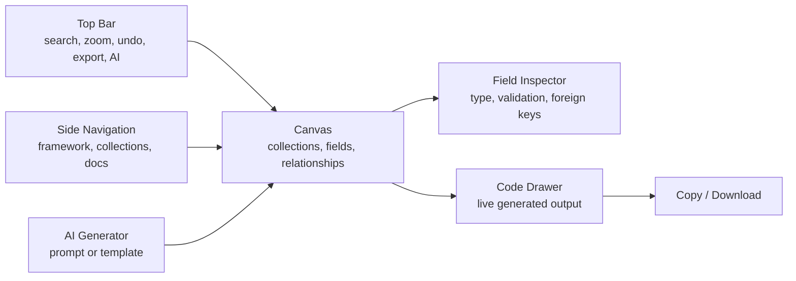
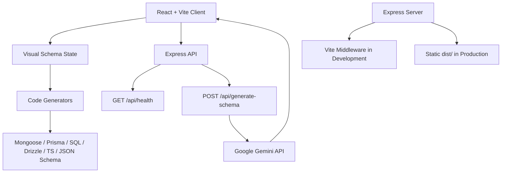

# SchemaFlow

<div align="center">


**A visual database schema studio with AI generation, relationship mapping, and instant ORM / SQL export.**

</div>

```text
                         SCHEMAFORGE

              +----------------------------------+
             /  Visual schema canvas            /|
            /---------------------------------- / |
           /  Users       Posts      Comments  /  |
          +----------------------------------+   |
          |  _id   PK    authorId  FK       |   |
          |  email       title               |   |
          |  createdAt    content            |  /
          |                                  | /
          +----------------------------------+

       Prompt -> AI model -> typed collections -> connected schema graph -> production code
```

## Why SchemaFlow

SchemaFlow turns database modeling into a live, visual workflow. Design collections and tables as draggable cards, connect foreign keys with animated relationship paths, tune field-level validation, then export the same model into the framework your backend actually uses.

It is especially useful when you want to move quickly from a product idea to a workable data model without bouncing between diagrams, docs, and hand-written schema files.

## Highlights

| Capability | What it gives you |
| --- | --- |
| Visual canvas | Drag, pan, zoom, search, and arrange collections on a dark grid workspace. |
| Field inspector | Edit field names, data types, required/unique rules, regex matches, defaults, and foreign key targets. |
| Relationship mapping | Render foreign key connections as smooth animated paths between collections. |
| Gemini AI generator | Describe an app in plain English or choose a starter template to generate a full schema. |
| Live code drawer | Preview generated code as you model, without leaving the canvas. |
| Export modal | Copy or download schema output for several backend targets. |
| Undo / redo | Move through schema editing history while experimenting. |

## Export Targets

SchemaFlowe can generate:

- Mongoose schemas and models
- Prisma schema models
- PostgreSQL `CREATE TABLE` DDL
- Drizzle ORM table definitions
- TypeScript interfaces
- JSON Schema draft-07 definitions

## Interface Map



## Architecture



## Tech Stack

- **React 19** for the interactive schema workspace
- **Vite 6** for fast local development and production builds
- **TypeScript** for application types and schema contracts
- **Tailwind CSS 4** for the dark, high-contrast interface
- **Express** for the app server and API routes
- **Google Gemini** through `@google/genai` for AI-assisted schema generation
- **Lucide React** for UI icons
- **Motion** for animation-ready UI behavior

## Quick Start

### 1. Install dependencies

```bash
npm install
```

### 2. Create your environment file

```bash
cp .env.example .env
```

On Windows PowerShell:

```powershell
Copy-Item .env.example .env
```

### 3. Add your Gemini API key

Open `.env` and set:

```env
GEMINI_API_KEY="your-gemini-api-key"
APP_URL="http://localhost:3000"
```

`GEMINI_API_KEY` is required only for the AI schema generator. The visual editor and code generation UI can still load without making AI requests.

### 4. Run the app

```bash
npm run dev
```

Then open:

```text
http://localhost:3000
```

## Scripts

| Command | Purpose |
| --- | --- |
| `npm run dev` | Start the Express server with Vite middleware. |
| `npm run build` | Build the Vite client and bundle the server into `dist/server.cjs`. |
| `npm run start` | Run the production server from `dist/server.cjs`. |
| `npm run preview` | Preview the Vite build. |
| `npm run lint` | Type-check the project with `tsc --noEmit`. |
| `npm run clean` | Remove generated build output. |

## API

### Health check

```http
GET /api/health
```

Response:

```json
{
  "status": "ok",
  "name": "SchemaForge Engine"
}
```

### Generate schema with AI

```http
POST /api/generate-schema
Content-Type: application/json
```

Body:

```json
{
  "prompt": "E-Commerce store with Users, Products, Categories, Orders, OrderItems, Cart, and ProductReviews.",
  "framework": "mongoose"
}
```

Response shape:

```json
{
  "success": true,
  "data": {
    "collections": [
      {
        "id": "col_1",
        "name": "Users",
        "position": { "x": 60, "y": 100 },
        "fields": []
      }
    ]
  }
}
```

## Project Structure

```text
SchemaForge/
  server.ts                  Express server, Vite middleware, Gemini API route
  index.html                 App shell and font loading
  vite.config.ts             Vite, React, Tailwind, and alias configuration
  src/
    App.tsx                  Main schema state, history, modals, and layout
    main.tsx                 React entry point
    types.ts                 Collection, field, validation, and framework types
    index.css                Tailwind import and custom canvas utilities
    components/
      AiGeneratorModal.tsx   Prompt and template-driven schema generation
      Canvas.tsx             Draggable collections and relationship lines
      CodeDrawer.tsx         Live generated code preview
      ExportModal.tsx        Copy/download output across target frameworks
      FieldInspector.tsx     Field type, validation, and foreign key editing
      NewCollectionModal.tsx Collection creation workflow
      SideNav.tsx            Framework selection and app navigation
      Header.tsx             Search, zoom, undo/redo, export, and AI actions
      DocsModal.tsx          Built-in cheat sheet
    utils/
      codeGenerators.ts      Mongoose, Prisma, SQL, Drizzle, TS, and JSON Schema emitters
```

## Data Model

The app models each schema as an array of `CollectionNode` objects:

```ts
interface CollectionNode {
  id: string;
  name: string;
  icon: string;
  colorTag: string;
  position: { x: number; y: number };
  fields: SchemaField[];
}
```

Fields support primary keys, foreign keys, validation metadata, and data types such as `String`, `Number`, `Boolean`, `Date`, `ObjectId`, `Array`, `JSON`, `Decimal`, and `UUID`.

## Production Build

```bash
npm run build
npm run start
```

In production mode, the Express server serves the compiled Vite app from `dist/` and keeps the API routes available under `/api`.

## Troubleshooting

| Problem | Fix |
| --- | --- |
| `GEMINI_API_KEY environment variable is missing.` | Add `GEMINI_API_KEY` to `.env` and restart the server. |
| Port `3000` is already in use | Stop the process using that port or change `PORT` in `server.ts`. |
| AI request fails | Check the API key, request quota, and server console output. |
| Exported relationships look wrong | Confirm each foreign key field points to the intended target collection and field in the Field Inspector. |

## Security Notes

- `.env` files are ignored by Git through `.gitignore`.
- Keep API keys out of commits, screenshots, and shared logs.
- The AI generator runs server-side so the browser does not need direct access to the Gemini key.

## Roadmap Ideas

- Persist schema projects to a database
- Import existing Prisma, SQL, or Mongoose schemas
- Add canvas minimap and keyboard shortcuts
- Add team comments and schema review mode
- Generate migrations in addition to model definitions

---

<div align="center">

Built for turning rough product ideas into structured, connected, exportable database schemas.

</div>
